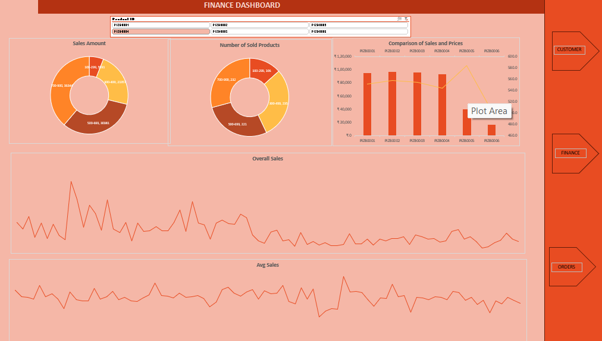
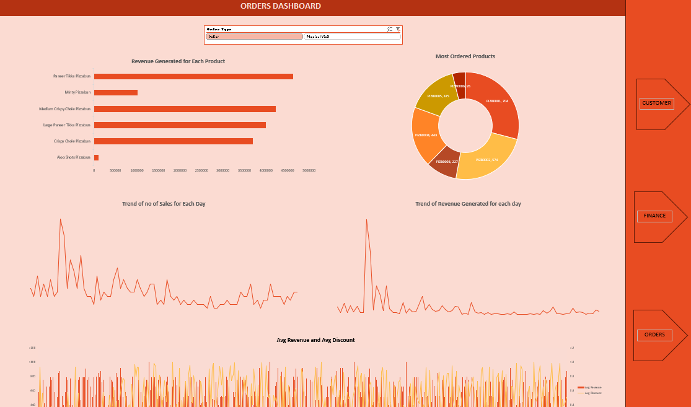

# 📊 Customer Analytics Dashboard (Excel Project)

This Excel dashboard project provides a data-driven view of customer satisfaction, financial performance, and order trends using advanced Excel features like pivot tables, slicers, and interactive charts.

---

## 📁 Project Files

- `Sumit_Customer_Analytics_Dashboard.xlsx`  
  > Contains all raw data, pivot tables, and three dashboards:  
  - Customer Service  
  - Finance  
  - Orders

---

## 🎯 Objective

To analyze and visualize key metrics from customer support and sales data for better decision-making.

---

## 💡 Key Features

- Agent-wise customer satisfaction analysis  
- Product discount and sales breakdown  
- State-wise and order-type trends  
- Interactive dashboards with slicers

---

## 🛠️ Tools Used

- Microsoft Excel  
- Pivot Tables  
- Slicers  
- Charts & Conditional Formatting

---

## 📸 Preview
## 📸 Dashboard Previews

### 👨‍💼 Customer Service Dashboard

&nbsp;

  

### 💰 Finance Dashboard

### 📦 Orders Dashboard![customer_ds]

## 👨‍💻 Author

**Sumit Mehta**  
Connect with me on [LinkedIn](www.linkedin.com/in/sumit-mehta-644431297)  
